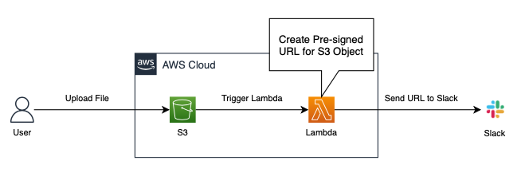

##  S3 presigned URLs with Slack
aws-s3-resigned-url-to-slack
This example shows how to set up your S3 event notification to invoke Lambda and send Signed URLs to your Slack channel



## Prerequisites
- Make sure you have [AWS CLI](https://docs.aws.amazon.com/cli/latest/userguide/install-cliv2.html) installed and configured with an aws account you want to use.
- Ensure you have [nodejs](https://nodejs.org) installed.
- Ensure you have [direnv](https://direnv.net) installed.
- Ensure you have [Slack Webhook](https://api.slack.com/messaging/webhooks) set up.

### setting .envrc for direnv
```shell
export AWS_PROFILE=<the configuration profile for aws-cli>
export BUCKET_NAME=<unique s3 bucket name>
export SLACK_CHANNEL=<slack webhook url>
```

### install cdk
```shell
npm install -g aws-cdk
cdk --version
```

### create virtualenv
```shell
python3 -m venv .venv
source .venv/bin/activate
```

### install requirements
```shell
pip install -r requirements.txt
```

### bootstrapping cdk
```shell
npx cdk bootstrap --profile <the configuration profile for aws-cli>
```

### deploy 
```shell
npx cdk deploy S3PresignedStack
```


## Security

See [CONTRIBUTING](CONTRIBUTING.md#security-issue-notifications) for more information.

## License

This library is licensed under the MIT-0 License. See the LICENSE file.

